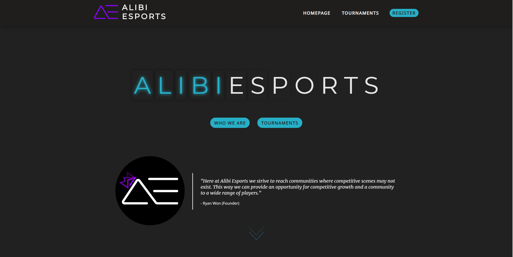
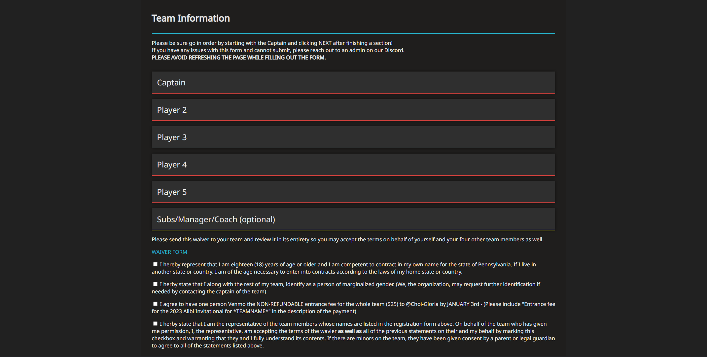

# Alibi Esports 

[Features](#features) •
[Screenshots](#screenshots) •
[Tech Stack](#tech-stack) •
[Packages](#packages)

## Features

This website serves as a medium for the esports organization, Alibi Esports, and their player base. The organization reaches out to communities and provides them with a competitive outlet for trending games. 

- An all-in-one platform for the organization and players to exchange information
- There is a scrollable landing page that explains what the company is about and what they strive to achieve through this organization
- Players can sign up for tournaments via the Register button, where they can input all of their team information including up to five players, a coach, a manager, and two subs.
- Players are also able to browser previous and upcoming tournaments on the tournaments page where the participating teams and final placements are displayed

## Screenshots

<h3 align="center">Landing Page<h3>

    

<h3 align="center">Team Registration Page<h3>

    

## Tech Stack

| Tech Name  | Home Page               |
| ---------- | ----------------------- |
| Node.js    | <https://nodejs.org/en/>   |
| React      | <https://reactjs.org/>  |
| Express.js | <https://expressjs.com/>  |
| PostgreSQL | <https://www.postgresql.org/> |
| Sequelize  | <https://sequelize.org/> |

## Packages

| Package Name      | Home Page                        |
| ----------------- | -------------------------------- |
| Axios             | <https://axios-http.com/docs/intro/>    |
| Aos               | <http://michalsnik.github.io/aos/>            |
| Letterize.js      | <https://github.com/WojciechKrakowiak/letterize/>         |

## Lessons Learned

As my first website put into production, there were a lot of obstacles I had to overcome to get this site to work. One of the biggest difficulties I'd like to talk about is developing with responsive web design in mind. I was still getting the hang of the front end technology (HTML & CSS) and found myself having trouble accounting for smaller screen sizes. 

Through a lot of Googling and looking at a ton of Stack Overflow posts, I was able to learn an insane amount in the short timespan of this project. This website was created for an organization and the deadline was in less than a week's time. While the timespan was short, this project logged me upwards of 80+ hours where I learned how to handle obstacles like, CSS animations, React useState hell (form handling for 7+ people and 4-6 fields each in a single form is no joke!), Express custom middleware (loggers and error handlers), and overall mainly improving my front end development skills.

Is this the best I can do? Absolutely not. I already feel like I could immensely improve countless things, but as my first step into professional web development, I will definitely look back on this fondly as I continue to improve my skills.

